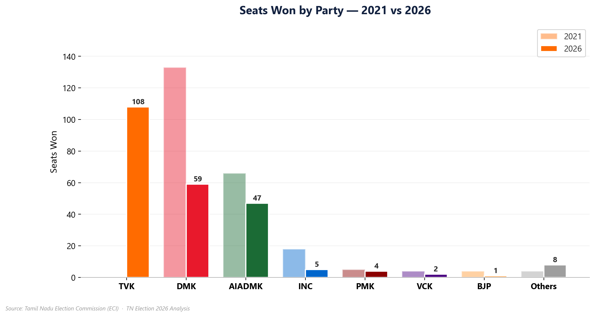
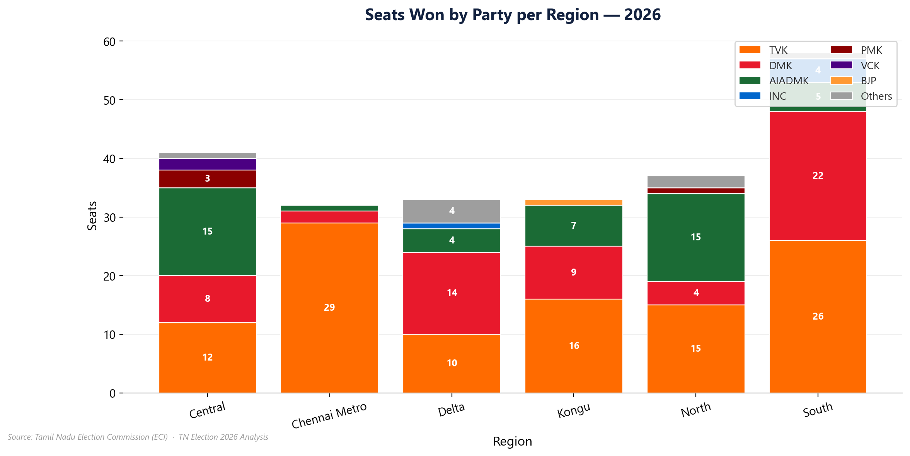
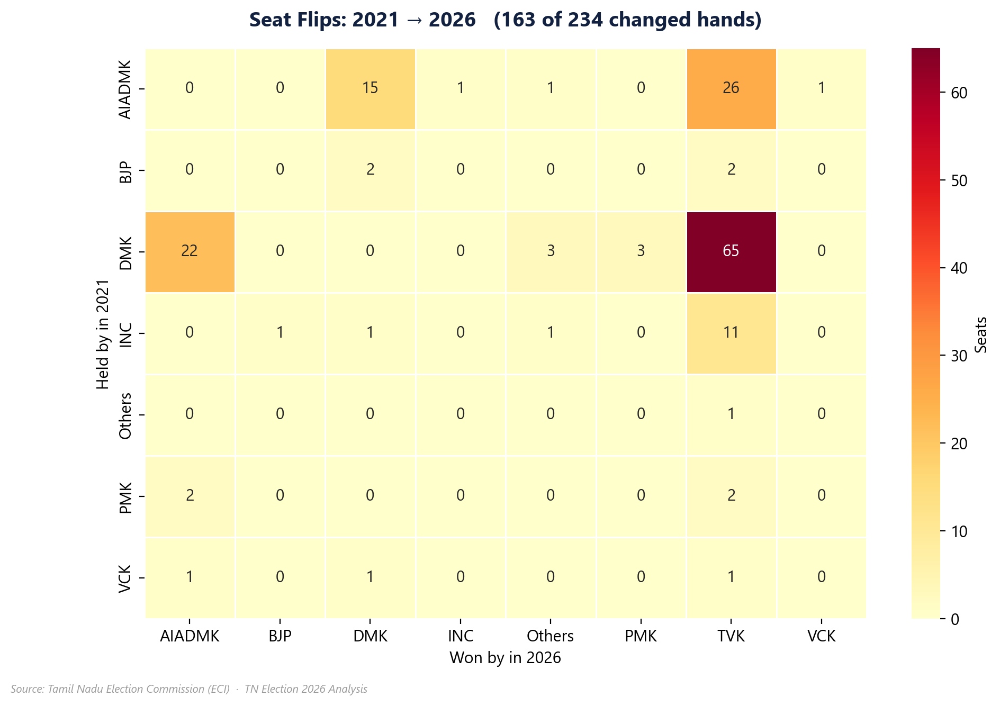
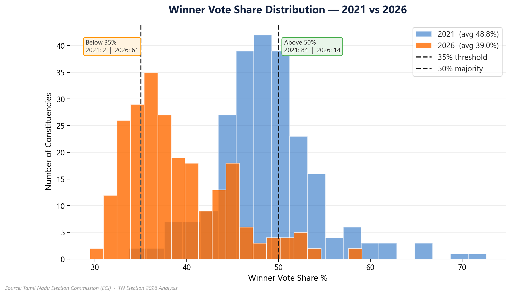
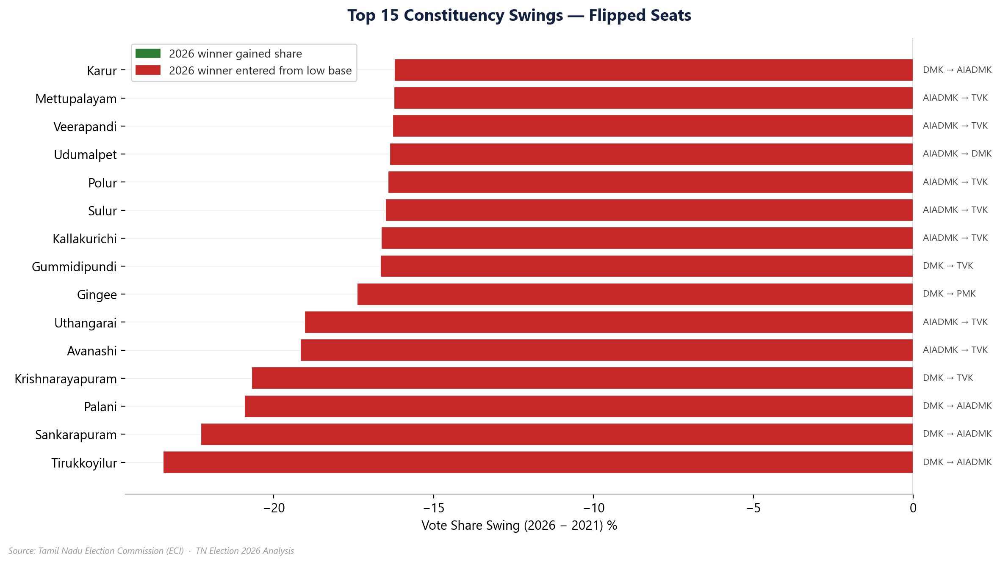
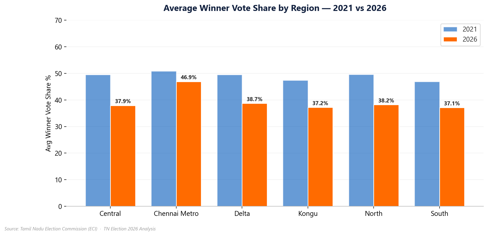

# Tamil Nadu 2026 Assembly Election — Political Realignment Analysis

## Executive Summary

Tamil Nadu's 2026 Assembly election reshaped the state's political map. A new
entrant, TVK, emerged as the single largest party without having contested in
2021, seat margins collapsed across the board, and 7 in 10 constituencies
changed hands. This analysis traces the realignment constituency-by-constituency
across 234 seats and 6 regions, and packages the findings into a branded
PowerPoint deck and an interactive Power BI dashboard.

> **Data note:** the result CSVs in `data/` are a **case-study / simulated
> dataset** modeling a hypothetical 2026 election (234 constituencies, matching
> the real Assembly's seat count, with real Tamil Nadu party names). Treat every
> figure below as analysis of this dataset, not verified official ECI results.

### Key Findings at a Glance

| Metric | 2021 | 2026 | Change |
|---|---|---|---|
| **Average Winner Vote Share** | 48.8% | 39.0% | **-9.8 pts** |
| **Winners with >50% share** | 84 | 14 | **-83%** |
| **Winners with <35% share** | 2 | 61 | **+2,950%** |
| **Seats that changed party** | — | 163 / 234 | **70%** |
| **Largest party** | DMK — 133 seats | TVK — 108 seats | New entrant leads |

---

## Dashboard Overview

### The 2026 Mandate



**What we observe:**
- TVK, absent from the 2021 field, wins 108 seats in 2026 — the single largest bloc.
- DMK falls from 133 to 59 seats; AIADMK falls from 66 to 47.
- Every other party (INC, PMK, BJP, VCK, CPI, CPI(M), DMDK, AMMK, IUML) is reduced to single digits.

### Regional Dominance



**What we observe:**
- No party sweeps all 6 regions — TVK's strength is not uniform across Chennai Metro, Kongu, Delta, North, Central, and South.
- Regional concentration means coalition arithmetic still matters despite TVK's overall lead.

### The Flip Story



**What we observe:**
- 163 of 234 seats (70%) changed hands — a sweeping anti-incumbency wave.
- The single biggest flow is **DMK → TVK (65 seats)**, followed by AIADMK → TVK (26) and DMK → AIADMK (22).
- TVK absorbed flipped seats from every major 2021 incumbent, not just the ruling party.

### Margin of Victory



**What we observe:**
- The 2021 distribution clusters above 50% (comfortable majorities); the 2026 distribution shifts sharply left.
- Winners securing less than 35% of the vote jumped from 2 to 61 — a sign of heavy vote-splitting across a more crowded field.

### Biggest Swings



**What we observe:**
- The largest individual swings are concentrated in seats that flipped directly to TVK from an established incumbent.
- Swing magnitude varies widely by constituency — this isn't a uniform statewide wave, it's uneven and locally driven.

### Regional Competitiveness



**What we observe:**
- Every region's average winning margin falls from 2021 to 2026, but not by the same amount — some regions stayed comparatively safe while others became true toss-ups.

---

## Root Cause Narrative

```
New entrant (TVK) contests statewide for the first time (2026)
              ↓
Anti-incumbency + vote-splitting across a crowded field
              ↓
Winner vote share collapses (48.8% → 39.0% average)
              ↓
Mass seat churn (163 of 234 seats flip, mostly incumbent → TVK)
              ↓
Fragmented mandate: no party or region fully dominant
```

---

## Interactive Power BI Dashboard

`tamilnadu.pbix` — 7 pages, built with slicers for live filtering by region and party:

**Cover · At a Glance · Regional Story · Flip Story · Margin Story · Party Performance · Constituency Explorer**

The **Constituency Explorer** page is the deepest cut: a sortable, filterable
table joining every constituency's 2021 and 2026 result side by side (candidate,
party, vote share, votes), sorted to surface the closest 2026 races first.

---

## What's in here

| File | Purpose |
|---|---|
| `election.py` | Original exploratory analysis — seat/region breakdown, flip matrix, margin-of-victory histogram |
| `build_dashboard.py` | Main pipeline: enriches the raw data, exports a 7-table Power BI data model, generates the 6 charts above, and builds a 10-slide branded PowerPoint deck |
| `upgrade_powerbi_report.py` | Programmatically generates/redesigns the Power BI report definition (PBIR format) — pages, KPI cards, slicers, tables — without touching Power BI Desktop |
| `TN_Election_2026_PowerBI_Theme.json` | Shared Navy & Gold brand theme (colors, fonts) used across the PPT and dashboard |
| `tamilnadu.pbix` | The Power BI dashboard |
| `data/` | Raw result CSVs + `data/outputs/` (generated charts, PPT, and Power BI data model exports) |

## Tech Stack

- **Python** — pandas (data enrichment), matplotlib/seaborn (charts), python-pptx (deck generation)
- **Power BI** — report authoring at the PBIR (schema/JSON) level: pages, slicers, cards, and tables generated by script rather than built by hand in Desktop

## Running It

```bash
pip install pandas numpy matplotlib seaborn python-pptx
python build_dashboard.py          # regenerates charts, PPT, and Power BI data model exports
python upgrade_powerbi_report.py   # regenerates the Power BI report pages/visuals
```

Both scripts resolve paths relative to their own location, so the project runs
from any clone without editing paths.
